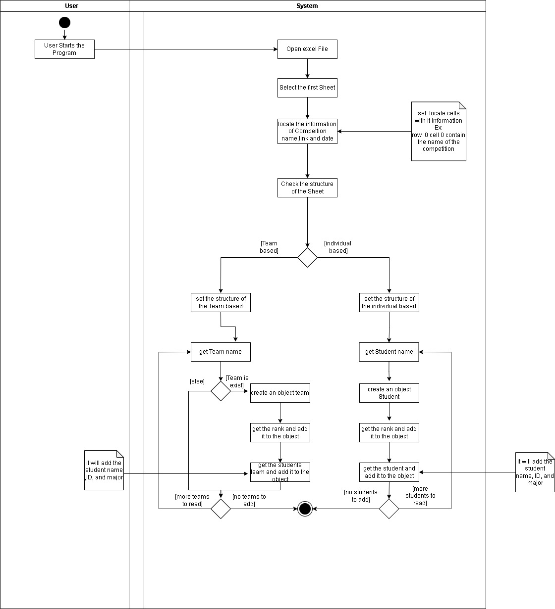
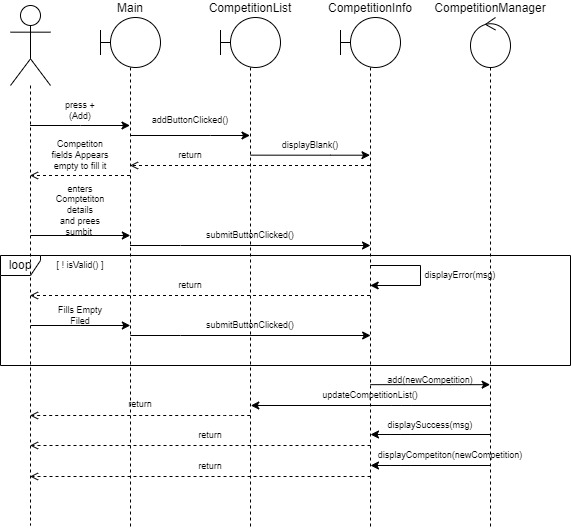
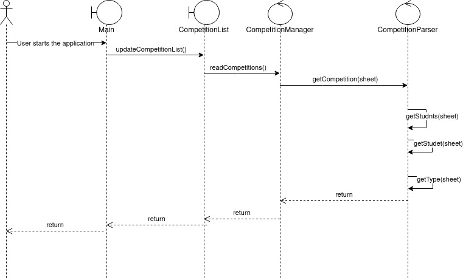

| Name                       | ID       |
|----------------------------|:--------:|
|Abdullah Nawar Thubaiti     | 201951090|
|Mohammad Khalid Mulia       | 201948550|
|Mohammad Saher Alshairbeeny | 201914330|
|Mohammed Ahmed Al-Easi      | 201971350|

\newpage

# Class Diagram:

\newpage

# Activity Diagrams:

## Add:

## Edit:

## Browse:

## View:

## Email:

## Read:

## Write:

\newpage

# Sequence Diagrams:

## Add:

## Edit:

## Browse:

## View:

## Email:

## Read:

## Write:

