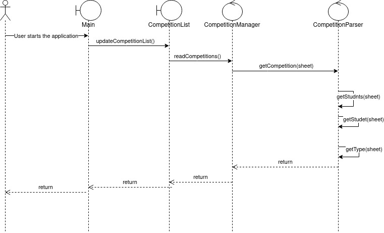
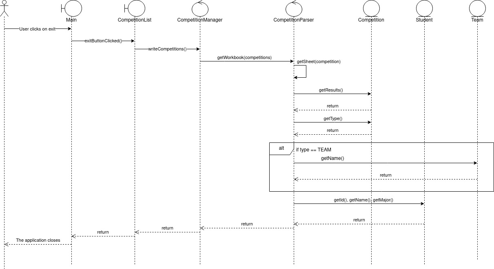
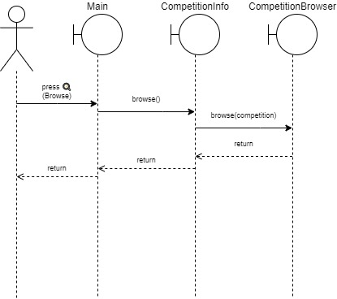
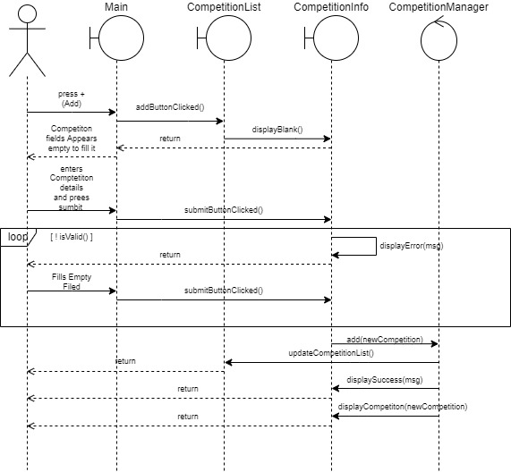
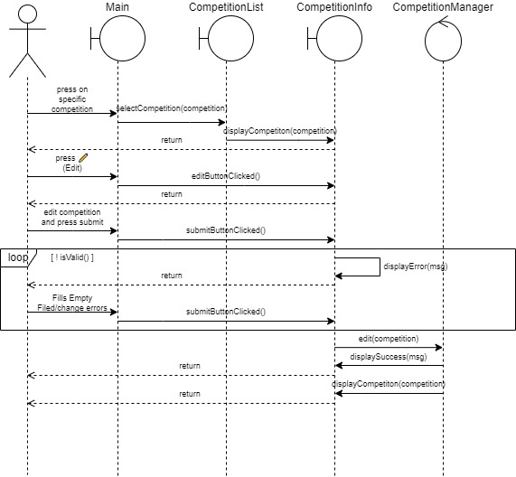

# TODOs

- [x] Entities: 100% complete

- [ ] Managers

    - Competition Manager
        - [ ] fix bug where you cant write two competitions that share the same
          name. Right now, I made it so that the manager will ignore a
          duplicate competition (a competition with the same name as another
          competition).

    - Competition builder
        - [ ] I don't think the code is very readable. Tell me your opinion.

        - [x] find a better way to store the style. The current way is too
          dirty. Suggestions:
                - UPDATE: done
                - ~~Pass the cell style object to the constructor competition
                  builder. This means that the competition manager will have to
                  store the style of the cell as one of its data fields. We only
                  have competition manager at a time. So it will not be as
                  wasteful as the current implementation. (The current
                  implementation is unacceptable because it reads the style
                  ~~everytime we try to create a sheet)

                - [x] Perhaps that competition manager should read the style from a
                  file called cellStyle.dat instead of trying to replicate
                  whatever it finds on the ID cell. It's also probably more
                  efficient way to do it

        - [x] Add date format to the competition specs.

        - Competition parser 100% complete

- [ ] Viewers: 0% complete

# Project Summary

## Phase 1

>I was disappointed... I had high exceptions from this group, and I still do.

We're better than that guys, lets create the best project ever in phase 2 and
phase 3!

## Phase 2

**Please add your diagrams to this list by editing the markdown file with your
favorite text editor**

